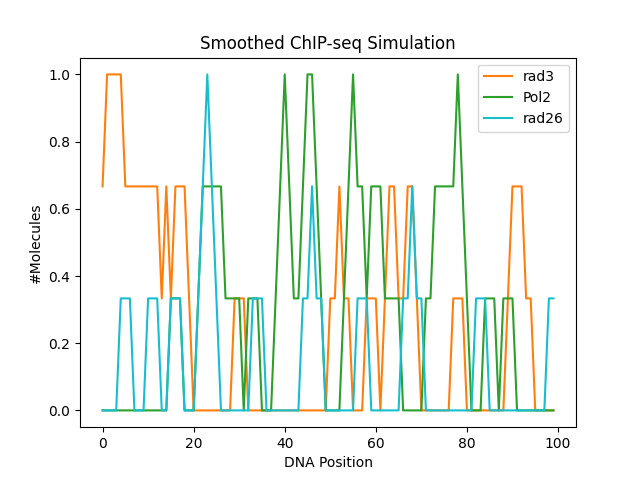
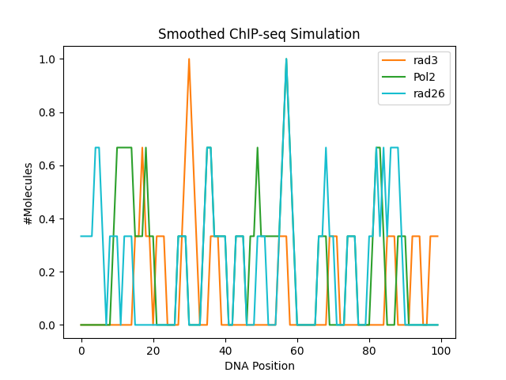
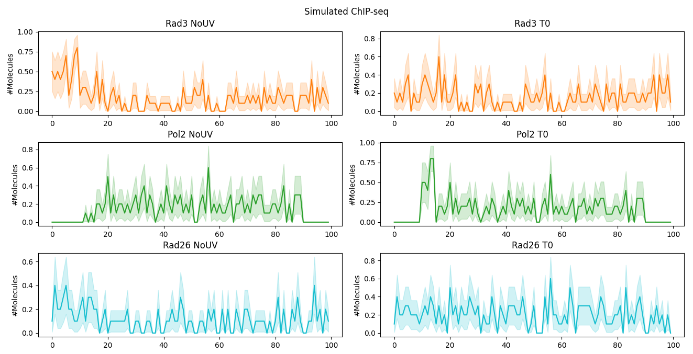

# Spatial Gillespie Algorithm

As with the dense nucleus model (see [here](README_denseNucleus.md), the spatial Gillespie algorithm 
assumes that there is no global knowledge. Every protein or particle interacts independently with the DNA
molecule. However, we make several important assumptions and simplifications

- The DNA is in a well-mixed solution. Therefore, we do not need to keep track of every protein that is 
somewhere in the nucleus
- When a protein interacts with the DNA, we incorporate the notion of space. Therefore, 
we randomly sample the position to which the protein binds
- We enforce that only a protein of the same kind can associate to the same position on the DNA. 
Although this might appear like some globally shared information, there is a biological reasoning. We
assume that every protein can bind to the DNA through establishing chemical bonds. The positions
where the protein can create these connections are then occupied, and no further protein with the same profile
can bind.
- Proteins of different kinds can bind to the same position if defined through a rule.

When aggregating several of these occupation profiles, we obtain a simulation of the sequencing results.

## The Gillespie Pool
The Gillespie pool is an implementation of the Gillespie algorithm [1], and is intended to simulate the pool of free
proteins in the nucleus. It is assumed that they are well mixed. Therefore, the notion of space is not necessary.
It permits the definition of influx and efflux to the nucleus (or compartment) as well as internal 
chemical reactions. 

## The Gillespie DNA
Proteins can associate from the Gillespie to the Gillespie DNA or dissociate from it. The Gillespie DNA follow the same
rules as [1], but with the notion of space. Thus, next to the type of reaction and the reaction time, we sample 
additionally a position to or from which a protein is associating/dissociating. The only exception is Pol2,
which can also move along the DNA. This movement is deterministic (from the TSS to the TTS).
It is assumed that elongation of Pol2 happens in parallel to association/dissociation. Therefore, Pol2 is
elongated with every protein that is associating or dissociating. The number of positions that it is moved
forward is proportional to the reaction time it takes for the other reaction to happen.

The Gillespie DNA contains different segments to which proteins can have different associating
or dissociating behaviour. A Rad3 protein, for example, can have a higher association probability to 
the core promoter than to other areas. In the current implementation, the following segments are predefined:
* Core promoter
* TSS
* Transcript 
* TSS

Radiation can induce lesions. These lesions are seen as a separate object. They are not a segment on the DNA. This 
makes it possible that a lesion can be in different states; and therefore, protein interactions
can be made dependent on enzymatic steps.
After radiation, a new set of rules can be passed to the Gillespie DNA. Hence, the interaction profiles of the 
proteins change.  

## Example
In the following we simulate a single gene with a comparatively high transcription rate in a normal setup

We induce a lesion between position 30 and 35 (on the x-axis). When the lesion is fully repaired, the interaction
profiles changed.

When aggregating the data over several iterations, we can approximate the ChIP-seq signal.

Repair takes between 3 and 10 minutes, which is in line with the findings of Erixon et al. [2].
 

## References
[1] Gillespie, Daniel T.
 "Exact stochastic simulation of coupled chemical reactions." 
 The journal of physical chemistry 81.25 (1977): 2340-2361.  

[2] Erixon, Klaus, and Gunnar Ahnström. 
"Single-strand breaks in DNA during repair of UV-induced damage in normal human and
xeroderma pigmentosum cells as determined by alkaline DNA unwinding and hydroxylapatite chromatography:
effects of hydroxyurea, 5-fluorodeoxyuridine and 1-β-d-arabinofuranosylcytosine on the
kinetics of repair."
Mutation Research/Fundamental and Molecular Mechanisms of Mutagenesis 59.2
(1979): 257-271.